# Traccount

#### Video Demo: [Traccount](https://youtu.be/ZKvqxDHS90o)

#### Description
A money tracker web application that allows users to track their cashflow, including income, expenses, borrow and lend money.

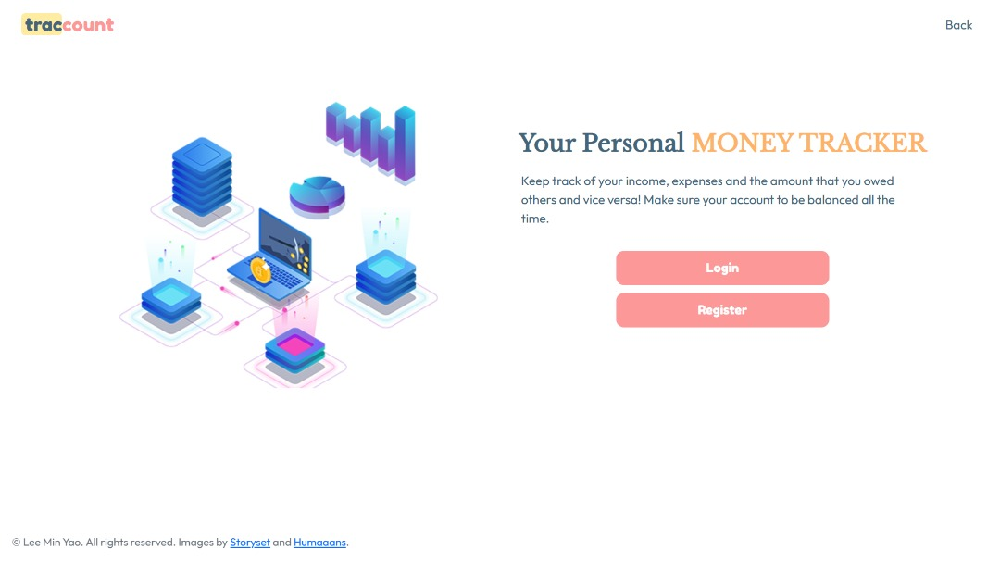

## Technologies
- Flask
- Python
- SQLite
- HTML
- CSS
- Javascript
- jQuery
- Bootstrap 5

## Installation
- Clone / fork this repository.
- Create a virtual environment in your local Traccount directory
- Install the requireed libraries listed in [requirement.txt](requirement.txt).
- Run the application
```
$ flask run
```

## Features
#### Login / Register
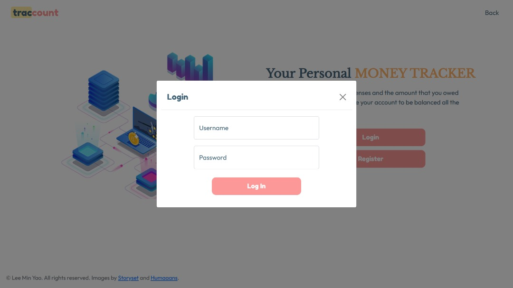
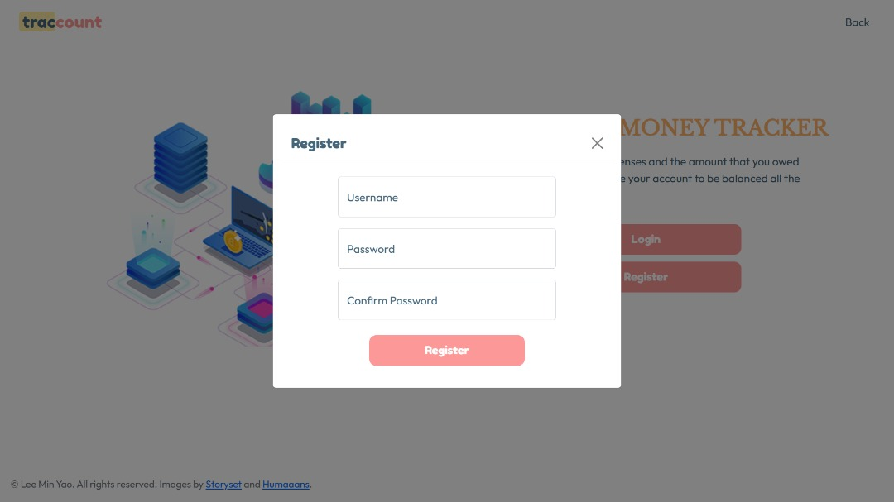
To use this application, users is required to create an account. Validation is implemented in back end. Each users will have a unique username as the username cannot be repeated. The password is hashed before stored in the database. However, **PLEASE DO NOT USE YOUR ACTUAL PASSWORD** for this application due to safety measures.

#### Dashboard
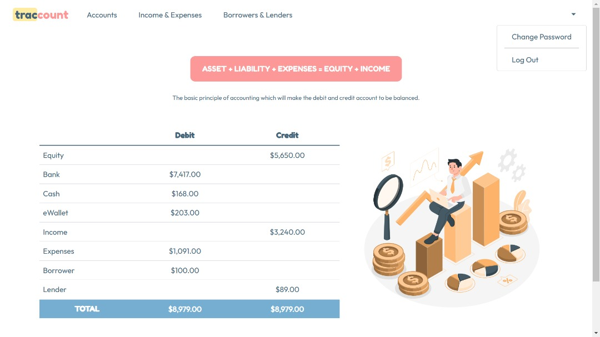
Users can check the summary of their assets, liability and equity here. The table is a balance sheet which the debit account will always equal to the credit account if the cashflow is recorded accurately.

#### Accounts
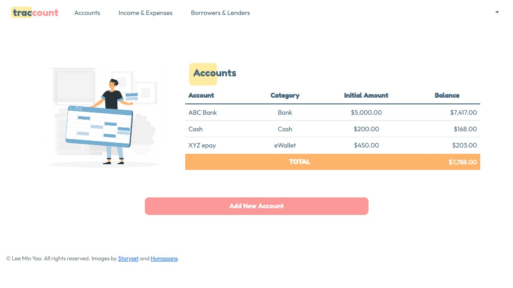
Users can check their account balance and add new account by clicking the *'Add New Account'* button. The input will be sent to back end via post request.

- ##### Add New Account
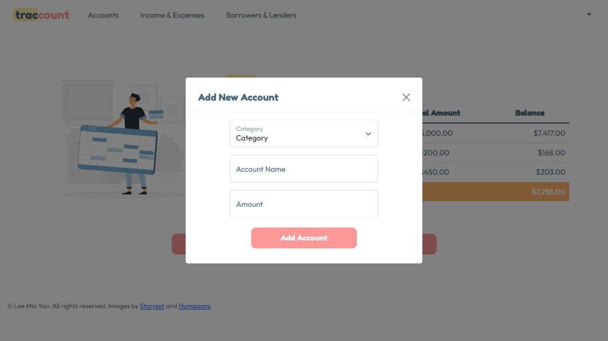
The form consists of 3 parts -- Category, Account Name and Amount. The category are fixed and users need to select for the available options.
The users is required to have a unique name for each account. The amount inputed must be positive and will be recorded as initial amount. This formed the equity of users in the balance sheet table. All the input will be stored in the table *'account'* in the SQLite database.
- Category
    - Cash
    - Bank
    - eWallet
    - Investment
    - Other

#### Income and Expenses
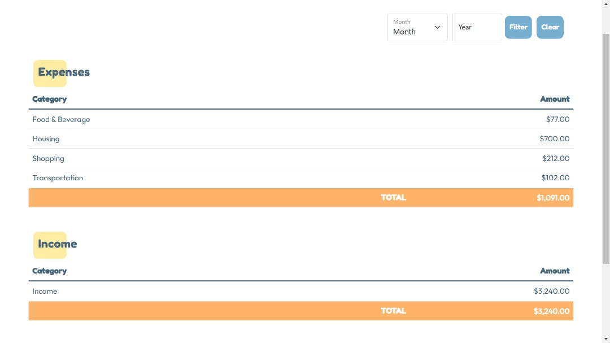
Users can check their summary of income and expenses based on categories. The users are given the option to check their income and expenses for specific month using the filter option that is positioned on the top-right of the page. Related tutorial for filter form can be found [here](https://codepen.io/lukesawczak/pen/gOPwyXo). By default, it will shows all the records of income and expenses. Users can add new income or expense using the *'Add New Record'* button. The input will be sent to back end via post request.

- ##### Add New Record: Income and Expenses
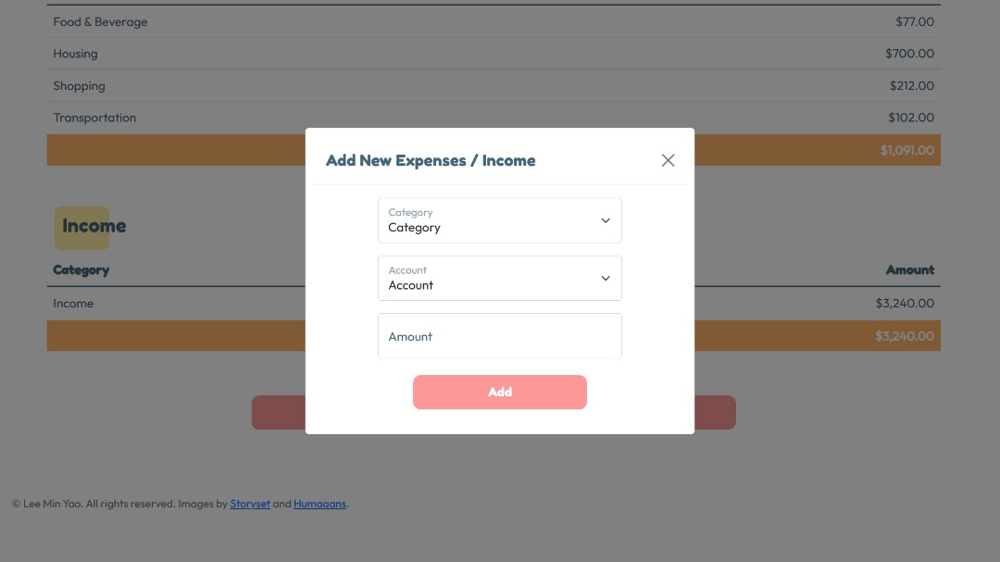
The form consists of 3 parts -- category, account and amount. Users need to choose a category from the available options. There are only one category for income, which is *'Income'*. Users must choose an account that have been used to spend or receive the money. The account options are based on the account added previously. Users are required to input a positive numeric number and the back end will classified the expenses and income based on the chosen category. If it is expenses, the amount will be recorded as negative number in the *'cashflow'* table in SQLite database and the selected account will deduct the amount from the balance. On the other way, the amount will be recorded as positive number and amount will be added to the balance of selected account.
- Category
    - Food & Beverage
    - Entertainment
    - Housing
    - Medical
    - Shopping
    - Transportation
    - Telecommunication
    - Finance
    - Miscellaneous
    - Income

#### Borrowers and Lenders
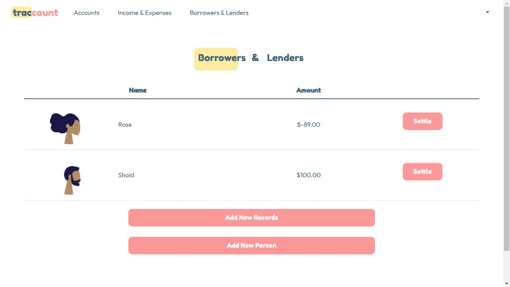
Users can check the amount that they owed or owed by others. To input a new record, the users first need to add a person via *'Add New Person'* button. The users can add a new record for borrowers and lenders using *'Add New Record'* button. If the users return money to others or vice versa, they can record the settlement using the *'Settle'* button. The input will be sent to back end via post request.

- ##### Add New Person
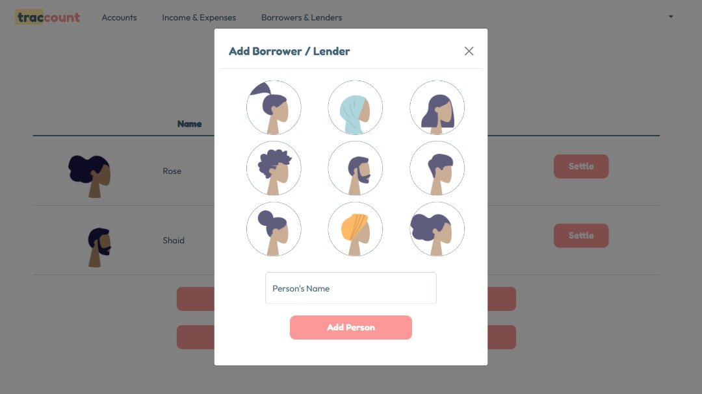
Users need to choose a picture from the images available and named the person. To avoid confusion, the users are not allowed to use repeated name for the person. The input will be inserted into the *'person'* table in database.

- ##### Add New Record: Borrowers and Lenders
.jpeg)
.jpeg)
Users are required to choose a whether they are a borrower or lender. Each option will trigger an additional form field for different input requirement *([tutorial can be found here](https://css-tricks.com/exposing-form-fields-radio-button-css/))*. The users need to choose a person involved and input the amount borrowed or lent.

##### 1. User as Borrower
If the users are a borrower, they need to choose a category that they used their borrowed money. The category is same as the one in income and expenses section withou the "Income" option. This later will be recorded in the *'cashflow'* table as expenses. The amount will be recorded as negative number and the amount of the selected person will be updated.

##### 2. User as Lender
If the users are a lender, the form will prompt the user to choose an account that they use to lend money. The balance of the account will be updated by deducting the amount lent. The amount will be recorded as positive number and the amount of the selected person will be updated.

- ##### Settlement
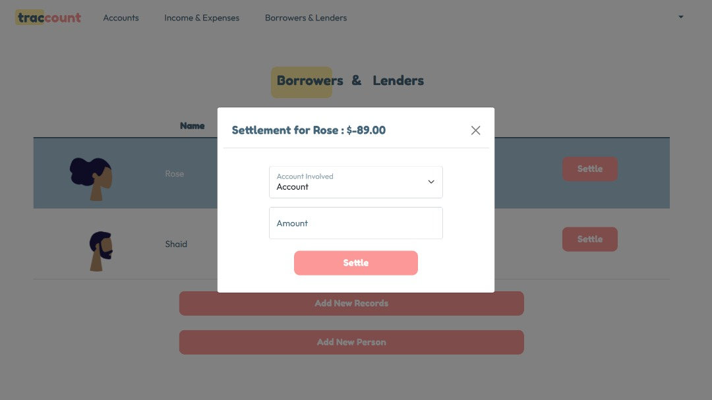
If users have returned the borrowed money or vice versa, they can use the *'Settle'* button to record the settlement. Users are required to choose the account used to return or receive money and input a positive amount. The balance of the person involved and the account will be updated. If users input an amount more than the amount needed to be returned, the application will automatically change the condition of person from lender to borrower and vice versa.

#### Change Password
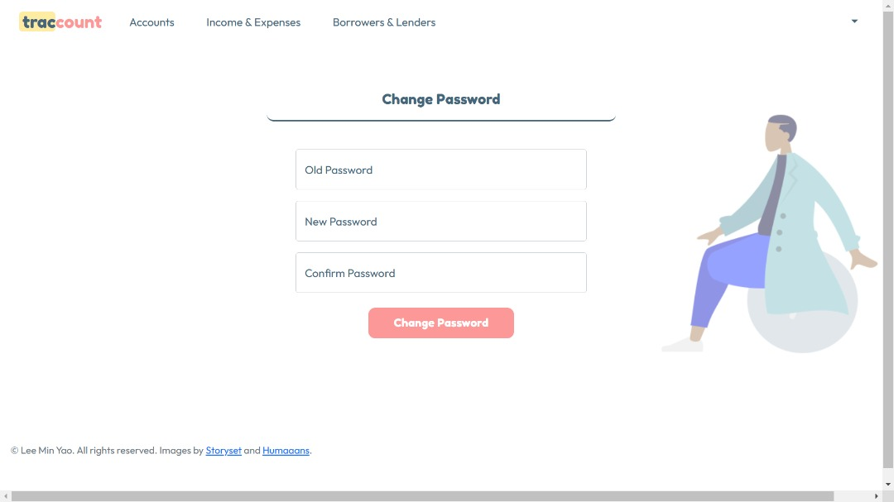
Users can change password in this page. Validation is implemented in back end.
